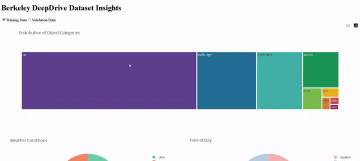
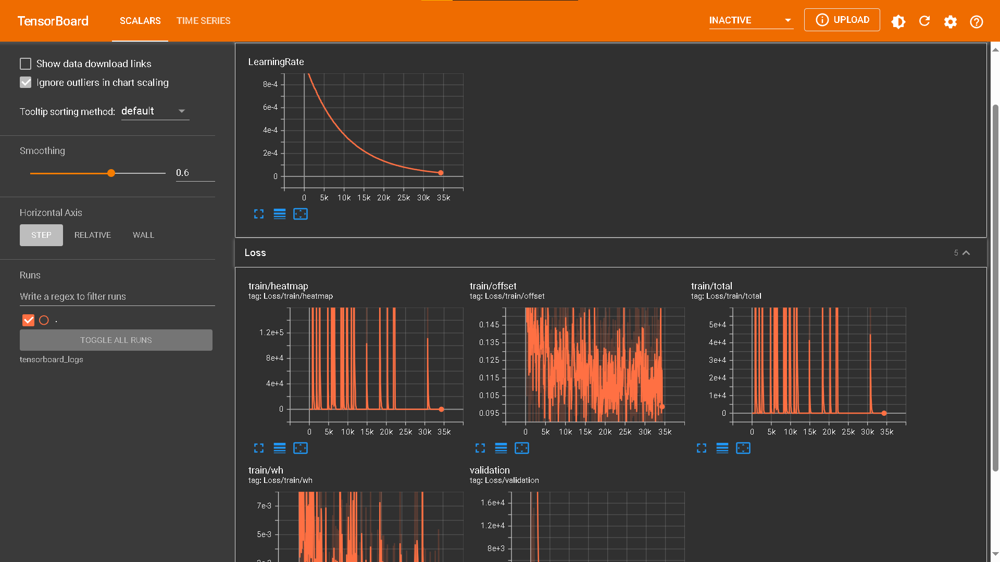
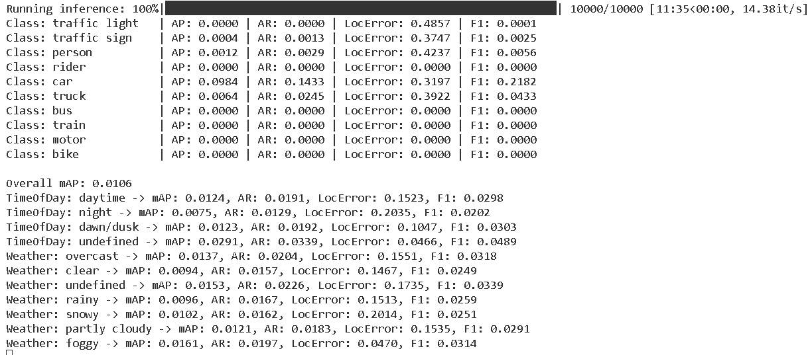

# BDD-object-detection

This repository demonstrates an end-to-end object detection pipeline using a custom object detection model (densenet backbone) from PyTorch/TorchVision. It covers data processing, model loading, inference, evaluation (qualitative and basic quantitative), and visualization, with a focus on clear structure, documentation, and containerization of the data processing step.

## Project Goal

To detect common objects (based on BDD dataset classes) in input images using a pre-trained deep learning model.

## Setup & Installation

**Prerequisites:**

* Python 3.9+
* `pip` (Python package installer)
* Docker (for running the containerized data task)
* Git

**Steps:**

1.  **Clone the repository:**
    ```bash
    git clone https://github.com/prithviramg/BDD-object-detection.git
    cd BDD-object-detection
    ```

2.  **Create a Python virtual environment (Recommended):**
    ```bash
    python -m venv venv
    source venv/bin/activate  # On Windows use `venv\Scripts\activate`
    ```

3.  **Install dependencies:**
    ```bash
    pip install -r requirements.txt
    ```
    *Note: Installing PyTorch (`torch`, `torchvision`) might require specific commands depending on your OS and CUDA version if using GPU. Refer to the [official PyTorch website](https://pytorch.org/get-started/locally/) for details.*

4.  **Place Input Data:**
    Put the `.jpg`, `.jpeg`, or `.png` images you want to process into the `data/raw/` directory.

## How to Run

### 1. Data Analysis (Containerized)


This part of the repository hosts a Dash application that performs exploratory analysis on the Berkeley DeepDrive (BDD) dataset annotations. **Note:** The huge JSON annotation files are not kept in the GitHub repository. You need to store them locally and mount the folder into the container.

#### A. Preparing Your Local Environment

1. **Download and Store the JSON Files:**

   Download the following files (if not already available) from the official BDD dataset sources:
   - `bdd100k_labels_images_train.json`
   - `bdd100k_labels_images_val.json`

   Place these files in a folder on your local machine (for example, in a folder named `data` located at `/path/to/your/local/data`).

2. **Configure the Application Code:**

   Ensure that your `data_analysis.py` (or data analysis file) uses relative paths to access the JSON files:
   ```python
   TRAIN_ANNOTATION_PATH = "data/bdd100k_labels_images_train.json"
   VAL_ANNOTATION_PATH = "data/bdd100k_labels_images_val.json"
   ```

#### B. Building the Docker Image
Then build your Docker image:

```bash
docker build -t my-dash-app .
```

#### C. Running the Container

Since the JSON files are not in your image, you need to mount them at runtime. Replace `/path/to/your/local/data` with the actual path where your JSON files are located.

**Using Docker Run:**

```bash
docker run -p 8050:8050 -v /path/to/your/local/data:/app/data my-dash-app
```

After starting the container, open [http://localhost:8050](http://localhost:8050) in your web browser to view the data analysis dashboard.

---

## Training Methodology

The training loop was implemented in PyTorch with the following strategies:

- **Backbone:** Densely connected convolutional networks (DenseNet121), adapted for object detection.
- **Feature Fusion:** 2 layer BiFPN (Bidirectional Feature Pyramid Network) for multi-scale feature aggregation.
- **Detection Heads:** CenterNet-style heads (2 parallel heads) for:
  - Heatmap prediction (for object center localization)
  - Size prediction (width, height of bounding boxes)
  - Offset prediction (for sub-pixel accuracy)
## Feature Map Usage

The model utilizes different feature levels for detecting objects of varying scales:

| Feature Level | Resolution Relative to Input | Purpose                        | Object Types           |
|---------------|------------------------------|--------------------------------|------------------------|
| P3            | 1/4                          | High-resolution features       | Traffic Signs, traffic Lights          |
| P4            | 1/8                          | Medium-resolution features     | other BDD objects |

This design choice ensures that smaller objects like traffic signs are detected using higher-resolution features, while larger objects like cars are handled by deeper, more abstract representations.

### Key Techniques:
- **Gaussian Heatmap Generation:** For center heatmaps, using 2D Gaussian distribution to encode object centers.
- **Focal Loss:** Used for classification heatmap prediction to handle class imbalance.
- **L2 Loss:** Used for size and offset regression tasks.



## Evaluation Metrics

Model performance is evaluated both quantitatively and qualitatively:

### Quantitative Metrics:
- **mAP@0.5 (Mean Average Precision at IoU threshold 0.5):** Measures precision-recall tradeoff.
- **Precision & Recall**
- **Center Error:** Average pixel error between predicted and ground-truth object centers.
- **Size Error:** Average difference in predicted vs actual bounding box dimensions.



### Qualitative Metrics:
- **Visual Inference Outputs:** Saved to `data/` with bounding boxes and class labels overlaid on input images.
- **Per-Class Detection Heatmaps:** Helpful for debugging and understanding class-wise confidence.

## Sample Visualizations

Images below demonstrate detection results on the BDD dataset using the trained model:


